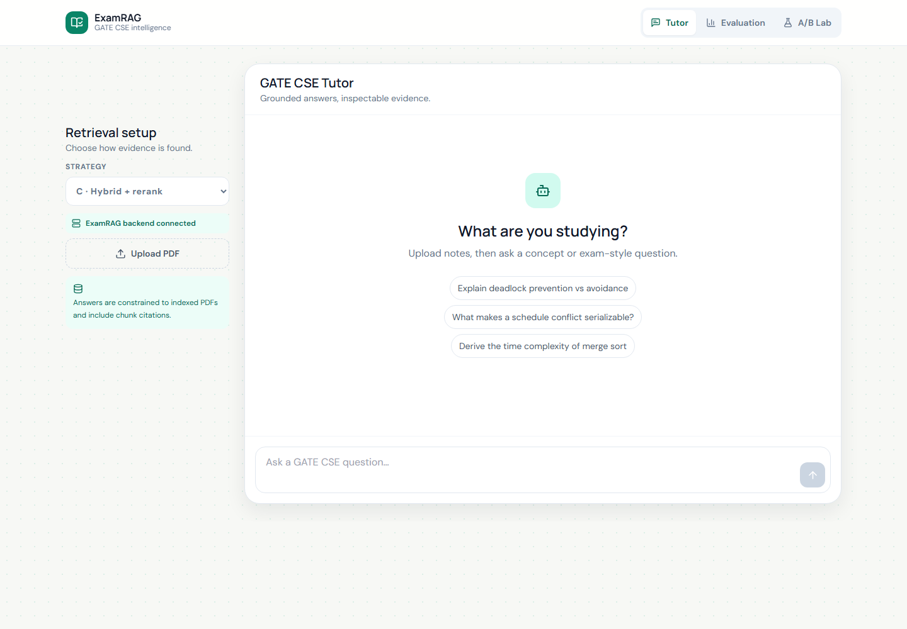
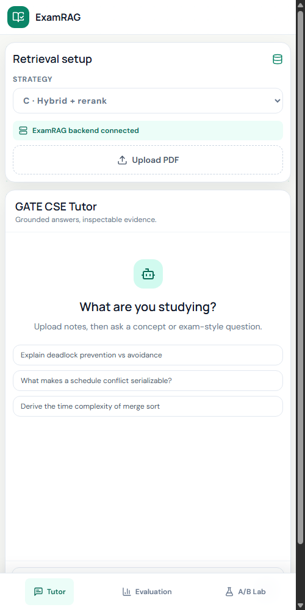
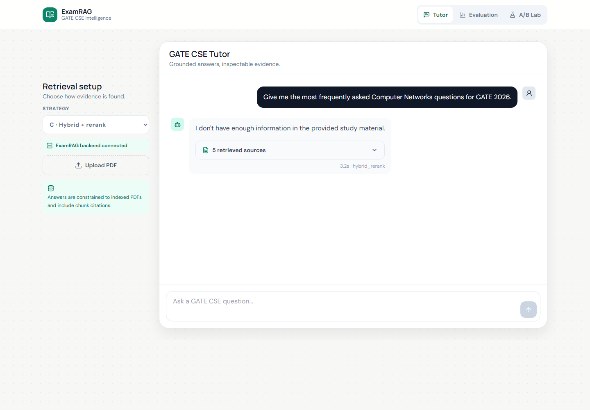
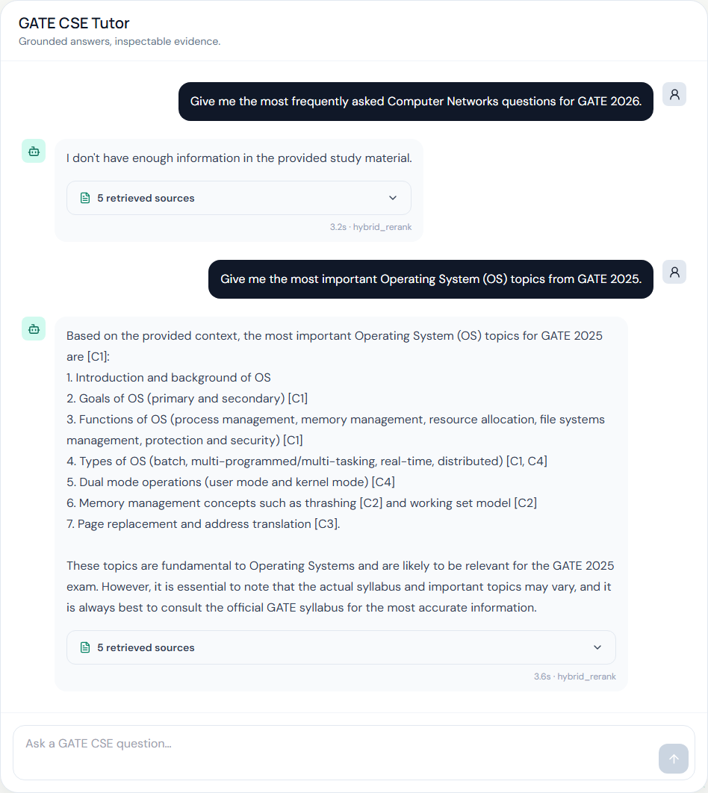

# ExamRAG

ExamRAG is a production-oriented retrieval-augmented generation system for GATE Computer Science study material. It combines local dense embeddings, BM25, reciprocal-rank fusion, cross-encoder reranking, grounded Groq generation, RAGAS evaluation, sentence-level NLI checks, and MLflow experiment tracking behind a FastAPI + React application. The frontend is implemented in plain **JavaScript/JSX** with Vite, not TypeScript.

The project is deliberately evaluation-first: three retrieval strategies use the same generation layer so that changes in answer quality can be attributed to retrieval.

## Product preview

### Desktop chat workspace



### Responsive mobile workspace

<p align="center">
  
</p>

## Grounding behavior demo

For this demonstration, the indexed knowledge base contains the **GATE 2025 CSE question paper** and an **Operating Systems study PDF**. ExamRAG is intentionally constrained to these uploaded documents instead of filling evidence gaps with unsupported model knowledge.

### Safe refusal when the indexed evidence is insufficient

The first query asks for the most frequently asked Computer Networks questions for **GATE 2026**. The indexed corpus contains no GATE 2026 paper or evidence that can establish future question frequency, so ExamRAG correctly responds that it does not have enough information. This refusal is expected behavior and demonstrates hallucination control.



### Grounded answer when the evidence exists

The next query asks for important Operating Systems topics from **GATE 2025**. This request is supported by the indexed GATE 2025 paper and OS study material, so ExamRAG produces an answer grounded in retrieved chunks and includes inline citations plus an expandable source list.



## What is implemented

- PDF ingestion with PyMuPDF, 500-token chunks, 50-token overlap, SHA-256 document IDs, page provenance, and inferred GATE subject/topic/difficulty metadata.
- Persistent cosine retrieval in ChromaDB with `BAAI/bge-small-en-v1.5`.
- Strategy A: dense top-5; Strategy B: dense + BM25 weighted reciprocal-rank fusion top-10; Strategy C: top-20 hybrid candidates reranked to top-5 using `cross-encoder/ms-marco-MiniLM-L-6-v2`.
- Strict context-only generation, inline `[C1]` citations, invalid-citation removal, and a deterministic insufficient-context response.
- JSON and server-sent event (SSE) chat modes.
- RAGAS faithfulness, answer relevancy, context precision, and context recall.
- Sentence-level `SUPPORTED`, `UNSUPPORTED`, and `POSSIBLE_HALLUCINATION` decisions using `cross-encoder/nli-deberta-v3-base`.
- Three-arm experiments with parameters, metrics, tags, and row-level artifacts logged to MLflow.
- React dashboards for streaming chat, evidence inspection, metric history, and strategy comparisons.

## Architecture

```mermaid
flowchart LR
    PDF[PDF study material] --> Parse[PyMuPDF parser]
    Parse --> Chunk[Token chunker\n500 / 50 overlap]
    Chunk --> Meta[Metadata inference]
    Meta --> Embed[BGE embeddings]
    Embed --> Chroma[(Persistent ChromaDB)]

    Q[Question] --> Dispatch{Strategy}
    Dispatch -->|A| Dense[Dense top-5]
    Dispatch -->|B/C| Both[Dense + BM25]
    Chroma --> Dense
    Chroma --> Both
    Both --> RRF[Weighted RRF]
    RRF -->|B top-10| Context[Grounded context]
    RRF -->|C top-20| Rank[Cross-encoder reranker]
    Rank -->|top-5| Context
    Dense --> Context
    Context --> Groq[Groq Llama generation]
    Groq --> Answer[Answer + inline citations]

    Answer --> NLI[NLI claim checker]
    Answer --> RAGAS[RAGAS judge metrics]
    NLI --> MLflow[(MLflow)]
    RAGAS --> MLflow
    MLflow --> UI[React evaluation dashboards]
```



The backend loads embedding, reranker, and NLI models lazily. The first request using each component downloads and warms that model; later calls reuse the process-level cache. Chroma storage and MLflow data survive container restarts in a named volume.

## Quick start with Docker

Prerequisites: Docker Desktop with Compose and a Groq API key. The initial image build and first model use download several gigabytes.

```bash
cp .env.example .env
# edit .env and set GROQ_API_KEY
docker compose up --build
```

Open:

- Application: <http://localhost:5173>
- FastAPI docs: <http://localhost:8001/docs>
- MLflow UI: <http://localhost:5001>

The default model is Groq's production `llama-3.3-70b-versatile`. Model availability can vary by account and over time; override `GROQ_MODEL` in `.env` without changing code.

## Local development

Python 3.11 is required.

```bash
python -m venv .venv
# Windows PowerShell
.venv\Scripts\Activate.ps1
pip install -r backend/requirements-dev.txt
copy .env.example .env
cd backend
uvicorn app.main:app --reload --port 8001
```

In a second terminal:

```bash
cd frontend
npm install
npm run dev
```

Open the local development UI at <http://localhost:5174>. Vite proxies `/api` to `http://127.0.0.1:8001`. Local backend state defaults to `backend/storage/`. Environment variables can override `CHROMA_PATH`, `UPLOAD_PATH`, `MLFLOW_TRACKING_URI`, model IDs, fusion weights, CORS origins, and chunk sizes; see `backend/app/config.py`.

## Typical workflow

1. Open the Tutor page and upload one or more text-based GATE CSE PDFs. Scanned image-only PDFs need OCR before upload.
2. Ask a question and inspect the expandable evidence chunks. Select A, B, or C in the sidebar.
3. Use `POST /evaluate` for a controlled dataset or open A/B Lab to run the same questions across all strategies.
4. Review aggregates in the Evaluation page and row-level artifacts in MLflow.

### API examples

Non-streaming chat:

```bash
curl -X POST http://localhost:8001/chat \
  -H "Content-Type: application/json" \
  -d '{"question":"Explain conflict serializability","strategy":"hybrid_rerank"}'
```

SSE chat sets `"stream": true`. The event sequence is `sources`, repeated `token`, then `done`; failures after the stream begins arrive as an `error` event.

Ingest:

```bash
curl -X POST http://localhost:8001/ingest -F "file=@data/raw_pdfs/os_notes.pdf"
```

Evaluate the supplied no-PDF fixture immediately:

```bash
curl -X POST http://localhost:8001/evaluate \
  -H "Content-Type: application/json" \
  --data-binary "{\"strategy\":\"hybrid_rerank\",\"items\":$(cat data/eval_dataset/eval_dataset.json)}"
```

On PowerShell, load the JSON and construct the request instead:

```powershell
$items = Get-Content data/eval_dataset/eval_dataset.json -Raw | ConvertFrom-Json
$body = @{ strategy = "hybrid_rerank"; items = $items } | ConvertTo-Json -Depth 10
Invoke-RestMethod http://localhost:8001/evaluate -Method Post -ContentType application/json -Body $body
```

The 18-item fixture contains answers and evidence contexts, so it exercises RAGAS, NLI, and MLflow without PDFs. Remove `answer` and `contexts` from each item to evaluate the full retrieval/generation path after ingesting relevant study material.

## Evaluation methodology

| Metric | What it answers | Healthy direction |
|---|---|---|
| Faithfulness | Are answer claims supported by retrieved evidence? | Higher; prioritize this metric |
| Answer relevancy | Does the answer directly address the question? | Higher |
| Context precision | Are useful chunks ranked before irrelevant chunks? | Higher |
| Context recall | Did retrieval cover facts required by the reference? | Higher |
| Hallucination rate | What share of answer sentences lacks strong NLI entailment? | Lower |
| Mean latency | What is end-to-end response time for the arm? | Lower, subject to quality |

RAGAS uses the configured Groq model as its judge and local BGE embeddings for answer relevancy. Scores are estimates, not ground truth: compare strategies on the same frozen dataset, inspect row-level failures, and repeat material experiments. NLI thresholds are explicit in `hallucination.py` and should be calibrated on human-labeled claims before using them as a release gate.

Illustrative portfolio baseline (not a claim about a fresh installation):

| Strategy | Faithfulness | Answer relevancy | Context precision | Context recall |
|---|---:|---:|---:|---:|
| A — Dense | 0.84 | 0.86 | 0.72 | 0.76 |
| B — Hybrid | 0.87 | 0.88 | 0.79 | 0.84 |
| C — Hybrid + rerank | 0.91 | 0.90 | 0.87 | 0.85 |

These example values show how to present an experiment. Actual results depend on the corpus, judge model, PDF quality, and questions; publish your own MLflow run IDs alongside portfolio claims.

## Endpoint contract

| Method | Path | Purpose |
|---|---|---|
| `POST` | `/chat` | RAG response; `stream=true` returns SSE |
| `POST` | `/ingest` | Validate, chunk, embed, and upsert a PDF (50 MB max) |
| `POST` | `/evaluate` | Evaluate supplied pairs or generate missing answer/context fields |
| `POST` | `/ab-test` | Run the same set through all three strategies |
| `GET` | `/eval-history` | Return recent MLflow evaluation runs |
| `GET` | `/health` | Lightweight liveness check |

## Reliability and security notes

- Upload names are sanitized, contents must begin with a PDF signature, size is bounded, temporary files are deleted, encrypted and textless PDFs fail clearly, and content hashes make re-ingestion idempotent.
- Groq calls have timeouts and retries. Empty retrieval never calls the LLM.
- Retrieval and model inference run outside FastAPI's event loop. For high throughput, move inference to dedicated workers and add a task queue for batch evaluations.
- This portfolio setup has no authentication. Add an identity provider, per-user collections, rate limiting, malware scanning, and secrets management before exposing it publicly.
- Prompt grounding reduces but cannot eliminate hallucination. Treat citations, NLI, and RAGAS as evidence for review rather than guarantees.

## Tests and validation

```bash
cd backend
pytest -q
python -m compileall app

cd ../frontend
npm run build
```

The unit suite covers fusion agreement, citation bounds/order, and domain metadata. Production CI should additionally use mocked embedding/Groq clients for API contract tests and a small pinned PDF for ingestion integration tests.

## Repository map

```text
backend/app/
  ingestion/   PDF extraction, chunking, metadata, embeddings, orchestration
  retrieval/   dense, BM25, weighted fusion, reranker, strategy service
  generation/  prompts, Groq client, citation validation, RAG service
  evaluation/  RAGAS, NLI detector, MLflow tracking, A/B runner
  db/          persistent Chroma setup
  models/      typed API contracts
frontend/src/
  pages/       Tutor, Evaluation, and A/B Lab
  components/  source, upload, and metric components
data/
  raw_pdfs/    local study material (PDFs are gitignored)
  eval_dataset/ 18-item controlled evaluation fixture
```
